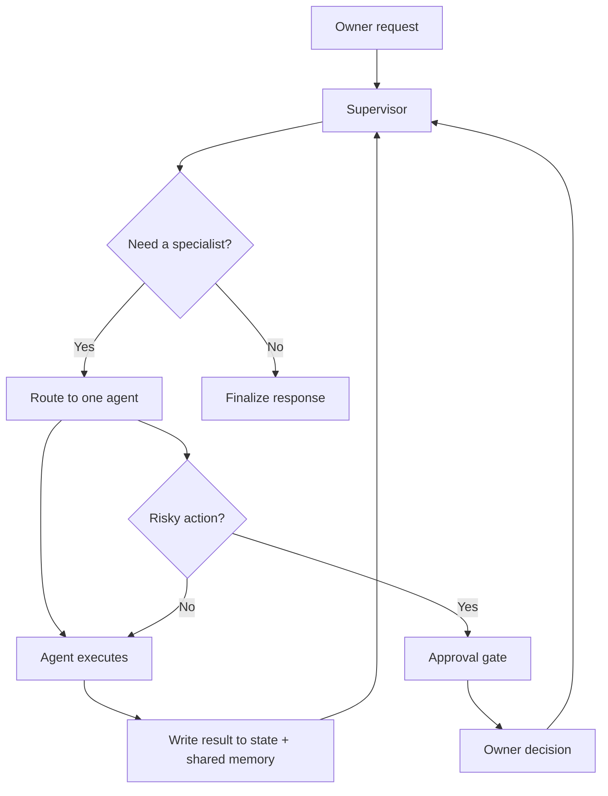

# Lucida Architecture Diagram and Design Notes

## 1. Overview
Lucida is a LangGraph-based multi-agent workforce designed for a small business owner. A single supervisor agent reads the request, decides which specialist should run next, and keeps the workflow adaptive instead of fixed. The system is built around state, shared memory, approval gates, and observability.

## 2. Agent model

| Agent | Role | Key capability |
| --- | --- | --- |
| Supervisor | Routing and orchestration | Chooses the next agent, plans the sequence, aggregates final output |
| Market Research | Demand and competition analysis | Web research and competitor pricing discovery |
| Product Vision | Photo-based product analysis | Product recognition and GO/NO-GO evaluation |
| Pricing | Financial logic | Margin, cost pricing, and break-even analysis |
| Inventory | Stock tracking | Inventory updates, restock alerts, quantity tracking |
| Ad Creative | Marketing output | Copywriting and campaign generation |
| Customer Engagement | Communication analysis | Sentiment, pre-orders, and customer demand analysis |
| Delivery | Logistics | Courier quote and booking workflow |
| Reporting | Summary generation | Final report and recommendation synthesis |

## 3. Control flow

## 4. Shared memory and state
The system separates business state from reasoning state:

- Structured database for records and transactions
- Vector memory for semantic retrieval across runs
- LangGraph state for agent handoff and task tracking

This lets the reporting agent retrieve prior pricing or research conclusions without forcing every intermediate message to carry the full historical context.

## 5. Human-in-the-loop design
Irreversible operations such as ad publishing and courier booking are paused using graph interrupts. The system suspends the run, waits for owner approval, and resumes the same graph state instead of restarting from scratch.

## 6. Observability
Every tool call, handoff, trace event, approval, and failure is captured in the event bus and persisted to the system record. This gives the web UI a live run view and supports debugging, cost review, and error containment.

## 7. Files of interest
- [src/lucida/supervisor.py](../src/lucida/supervisor.py)
- [src/lucida/graph.py](../src/lucida/graph.py)
- [src/lucida/state.py](../src/lucida/state.py)
- [src/lucida/memory](../src/lucida/memory)
- [src/lucida/tools](../src/lucida/tools)
- [src/lucida/agents](../src/lucida/agents)
- [web/app_ui.py](../web/app_ui.py)
- [serve.py](../serve.py)
