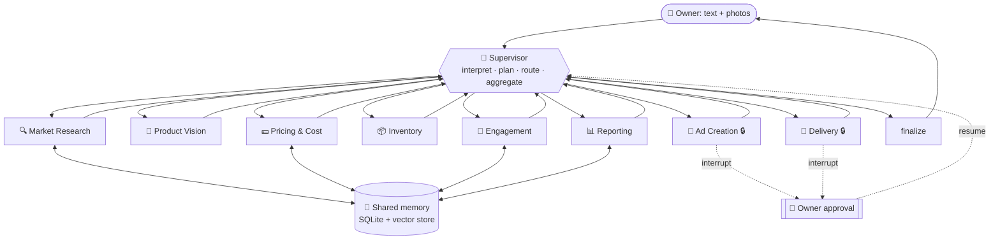

# 🏪 Lucida

A multi-agent AI system that acts as an **autonomous workforce for a small business** —
from deciding what to sell, through sourcing, pricing, marketing, customer listening
and delivery. A Supervisor agent coordinates eight specialists, keeps a shared memory
across the whole business lifecycle, and stops for the owner's approval before anything
irreversible or costly.

The owner talks to it in plain language — or just uploads a photo of what they make.

> **The differentiators:** a *photo-to-business-plan* flow (snap a product → identified,
> priced, validated, GO/NO-GO), and a *continuous customer-listening loop* that detects
> demand for things the business does not yet sell and feeds that back into replanning.

---

## Table of contents

- [What it does](#what-it-does)
- [Architecture](#architecture)
- [Setup](#setup)
- [Running it](#running-it)
- [The interface](#the-interface)
- [Demo script](#demo-script)
- [Live vs simulated integrations](#live-vs-simulated-integrations)
- [Project structure](#project-structure)
- [Design notes](#design-notes)
- [Troubleshooting](#troubleshooting)

---

## What it does

The system supports the full small-business lifecycle. The Supervisor works out which
stage the owner is in and routes accordingly — it does not march through all eight
agents for a simple question.

| Stage | What happens | Agent |
|---|---|---|
| 1. Idea & market research | *"What business should I start in Dhaka with 30k?"* → live web search for demand, competition and price bands | 🔍 Market Research |
| 2. Product validation | Owner uploads a photo → product identified, demand assessed, price band estimated, **GO / NO-GO** | 📸 Product Vision |
| 3. Owner decision | Owner approves, rejects, or requests changes | 🙋 Human-in-the-loop |
| 4. Inventory setup | Photos + quantities → structured stock record, low-stock thresholds | 📦 Inventory |
| 5. Marketing launch | Platform-specific ad copy → **owner approves** → published to FB / IG / YouTube | 📣 Ad Creation |
| 6. Customer engagement | DMs and comments read → sentiment, pre-orders extracted, **unmet demand detected** | 💬 Engagement |
| 7. Reporting & replanning | Restock alerts, demand shifts, recomputed financials, revised plan | 📊 Reporting |
| 8. Delivery | Courier booked via Pathao / Steadfast / Uber after **owner confirms** | 🚚 Delivery |

Pricing runs through all of it — cost-plus price, margin, break-even and competitor
comparison, computed in a real Python sandbox rather than asserted in prose.

---

## Architecture

Supervisor-routed star topology on **LangGraph**. Every specialist returns to the
Supervisor, which re-decides — so new information (a customer asking for a product you
don't stock) can send the workflow *backwards* into research or pricing instead of
forcing it down a fixed pipeline.



🔒 = suspends the entire graph to a SQLite checkpointer until the owner answers.

**Full architecture write-up:** [`docs/architecture.md`](docs/architecture.md) — topology,
the two collaboration channels, HITL mechanics, tool degradation paths, observability,
and the design decisions behind each.

---

## Setup

**Requirements:** Python 3.11+ and one model-provider API key.

```bash
git clone <your-repo-url>
cd Business_Marketing_Analysis_LLM

python -m venv .venv
# Windows
.venv\Scripts\activate
# macOS / Linux
source .venv/bin/activate

pip install -r requirements.txt
```

Configure credentials:

```bash
cp .env.example .env          # Windows: copy .env.example .env
```

Open `.env` and set **one text-provider key**:

```env
AIW_PROVIDER=groq            # groq | anthropic | google
GROQ_API_KEY=gsk_...         # free tier at console.groq.com
```

That is enough to run. Every other credential is optional — each missing one degrades
to a free fallback or a clearly-labelled simulated adapter rather than breaking the
system.

### Choosing a provider

| Provider | Cost | Photo understanding | Notes |
|---|---|---|---|
| **`groq`** (default) | Free tier | ❌ **none** | Fast. Serves no multimodal model, so the photo flow is disabled unless you add a vision key below. Free tier caps tokens/minute per model, so a long run paces itself. |
| `anthropic` | Paid | ✅ strongest | Best structured-output reliability and the best photo reading. |
| `google` | Generous free tier | ✅ good | A reasonable middle ground; also works as the vision provider on its own. |

> **Turning the photo flow back on while staying on Groq.** Photo-to-business-plan is
> the project's headline feature, and Groq cannot do it. Add a **free** Google AI Studio
> key ([aistudio.google.com/apikey](https://aistudio.google.com/apikey)) as
> `GOOGLE_API_KEY` and the Product Vision agent starts reading images again — the text
> agents stay on Groq. The vision provider is configured independently of the text one,
> so nothing else changes.
>
> Without a vision key the system does **not** pretend: the Product Vision agent says
> plainly that it could not look at the photo, falls back to validating from your written
> description, and tells you how to enable it.

| Optional key | Without it |
|---|---|
| `GOOGLE_API_KEY` / `ANTHROPIC_API_KEY` | Photo understanding is off (see above) |
| `TAVILY_API_KEY` | Web search falls back to DuckDuckGo (free, no key) |
| `META_ACCESS_TOKEN`, `META_PAGE_ID`, `META_IG_USER_ID` | FB/IG publishing + inbox use the simulated adapter |
| `YOUTUBE_API_KEY` | YouTube publishing simulated |
| `PATHAO_*` / `STEADFAST_*` | Courier booking simulated |

---

## Running it

There are two front-ends over the same workforce. Both read and write the same
shared memory, so you can switch between them freely.

### The Business Suite workspace (primary)

```bash
python serve.py
```

Open **http://127.0.0.1:8000**.

This serves the `Business Suite` design bundle in [`web/design/`](web/design/)
exactly as authored — its own markup, its own React runtime, its own fonts.
Nothing is redrawn. Two additive patches make it Lucida's:

* `window.__resources` points the runtime's CDN URLs at vendored copies of
  React / ReactDOM / Babel, so the page runs with no external requests.
* Each data constant prefers `window.LUCIDA.<key>`, which the server injects
  inline before the runtime boots. **Where the database is empty the design
  falls back to its own literals**, so a fresh install still renders as drawn
  and real data replaces it section by section as agents populate memory.

The design's own controls are wired through: **Ask** puts a question to the
workforce, and a decision card's approve / not-now answers a real approval gate.

Re-apply the patches after replacing the bundle:

```bash
python web/patch_design.py     # idempotent; keeps a pristine index.orig.html
```

### The Streamlit app (fallback)

```bash
streamlit run app.py
```

Open **http://localhost:8501**. Kept as a working fallback; it additionally
supports photo upload and streams agent narration live, which the workspace
does not yet do.

Either way, integration status is shown as 🟢 LIVE / 🟡 SIMULATED / 🔴 MISSING,
so it is always unambiguous which parts are calling real APIs.

> **TLS-inspected networks.** If provider calls fail with
> `APIConnectionError: Connection error`, the real cause is usually
> `CERTIFICATE_VERIFY_FAILED`: antivirus or a corporate proxy is intercepting
> TLS with a root CA that lives in the OS trust store but not in certifi's
> bundle. `truststore` (in `requirements.txt`) is injected in
> [`config.py`](src/lucida/config.py) to make Python use the OS store instead.

### Tests

A component suite covers the deterministic machinery — code sandbox (including its
security policy), RAG retrieval, simulated adapters, cost accounting and graph wiring.
**It needs no API key and spends no tokens**, so you can verify the system works before
running it:

```bash
python tests/test_workforce.py      # or: python -m pytest tests -v
```

---

## The interface

Eight panels, all reading the same underlying stores the agents write to:

| Tab | What it shows |
|---|---|
| 📊 **Dashboard** | Lifecycle stage tracker, agent roster with run counts, business KPIs, current plan |
| ⚡ **Live trace** | Every agent start/end, tool call, hand-off, LLM call and error, filterable by agent and event type |
| 🔀 **Agent comms** | The message bus — every task the Supervisor delegated and every structured payload returned |
| 🕸️ **Execution graph** | The rendered LangGraph state diagram (Mermaid + PNG download) |
| 💰 **Cost** | Token usage and USD cost, broken down per agent and per call, with the rate card |
| 📜 **Logs** | Filterable log stream, error report with tracebacks, downloadable |
| 🧠 **Memory** | Structured tables, semantic documents, and a **retrieval test** that runs the same RAG query an agent runs |
| 📄 **Report** | The final rendered report + archive of all past reports, downloadable as Markdown |

**Human-in-the-loop controls** appear at the top of the page whenever the graph is
suspended: **Approve** / **Request changes** (with feedback → the agent rewrites) /
**Reject**. Plus **Retry** and **New session** in the sidebar.

---

## Demo script

A ~6 minute walkthrough of one complete business lifecycle.

**1. Idea research** — in the sidebar, ask:
> *"I have 30,000 taka and I can cook. What food business should I start in Dhaka?"*

Watch the **Live trace**: the Supervisor plans, routes to Market Research, which runs
four real web searches and returns a ranked niche with a competitor price band.

**2. Photo-to-business-plan** — upload a photo of a food item or product and ask:
> *"Is this worth selling? What should I charge?"*

Product Vision identifies it from the image, then re-searches the market *for that
specific product*, and returns a GO / NO-GO. The Pricing agent picks it up and computes
margin and break-even in the Python sandbox — open the **Agent comms** tab to see the
`competitor_price_low/high` field flow from Market Research straight into Pricing.

**3. Inventory** — open *Stock intake* in the sidebar, enter a product name, quantity
and unit cost, then ask:
> *"I bought this much stock — record it and tell me what to reorder."*

**4. Marketing + approval gate** — ask:
> *"Write and publish ads for this."*

The workflow **pauses**. The ad preview appears at the top of the page. Click
**Request changes**, type feedback (e.g. *"make the Bangla less formal, lead with the
price"*), and watch the agent rewrite and come back for approval again. Then **Approve**.

**5. Customer listening** — ask:
> *"What are customers saying?"*

The Engagement agent reads the inbox (simulated by default — Bangla, Banglish and
English messages), classifies sentiment and intent, extracts pre-orders, and flags
**demand for products not in the catalog**.

**6. Reporting** — ask:
> *"Give me this week's report and what I should change."*

The Reporting agent pulls across every earlier stage via RAG, recomputes the financials
in Python, and writes the report with a revised plan. Show the **Memory → Retrieval
test** tab, query *"what price did we decide and why"*, and demonstrate that it returns
the Pricing agent's reasoning from several stages ago — this is the shared-memory
mechanism, made inspectable.

**7. Close** — show the **Cost** tab (per-agent token spend for the whole run) and the
**Execution graph**.

---

## Live vs simulated integrations

| Integration | Status | Notes |
|---|---|---|
| Claude (reasoning + vision) | **Live** | Required |
| Web search | **Live** | Tavily if keyed, else DuckDuckGo free tier |
| Code execution | **Live** | Restricted local sandbox |
| RAG / vector memory | **Live** | In-process, offline |
| SQLite business database | **Live** | — |
| Meta Graph API (FB / IG) | Live *if keyed*, else **simulated** | Needs business verification |
| YouTube | **Simulated** publishing | Uploads need OAuth user consent, not just an API key |
| Pathao / Steadfast | Live *if keyed*, else **simulated** | Needs a merchant account |

Simulated adapters return responses in the **same shape** as the live ones, so agent
logic never branches on which mode is active. The `simulated` flag is surfaced in the
trace, the database, the ad preview and the final report — nothing silently passes fake
data off as real. Adding the API key to `.env` switches the adapter to live with **no
code change**.

---

## Project structure

```
serve.py                   Business Suite workspace entry point (port 8000)
web/design/                The design bundle, served as authored
web/design/index.orig.html Pristine bundle — patches are re-applied from this
web/patch_design.py        Adds the offline + data hooks to the bundle
web/bridge.py              Maps shared memory onto the design's data shapes
app.py                     Streamlit entry point (port 8501, fallback)
ui/theme.py                Design tokens + components for the Streamlit UI
ui/pages.py                Streamlit section renderers
ui/panels.py               Panel render functions
docs/architecture.md       Full architecture write-up
src/lucida/
  config.py                Settings + LIVE/SIMULATED capability flags
  pricing.py               Token accounting + USD cost estimation
  llm.py                   Claude client factory
  observability.py         Logging, trace bus, error containment
  state.py                 LangGraph state schema
  supervisor.py            Planner / router / aggregator
  graph.py                 Graph assembly + runtime
  memory/{db,vector,shared}.py
  tools/{web_search,vision,code_exec,social,courier}.py
  agents/{base,schemas,+ 8 agents}.py
data/                      SQLite DBs, vector store, uploads (git-ignored)
```

---

## Design notes

- **Star topology, not a pipeline.** Every agent returns to the Supervisor, so customer
  signal can send the workflow backwards into research or pricing.
- **Memory, not just messages.** Findings persist in SQLite + a vector store, so the
  Reporting agent can retrieve the Pricing agent's reasoning from three stages earlier —
  across sessions and process restarts.
- **Python owns the arithmetic, the model owns the judgement.** Margins and break-even
  are recomputed deterministically at the model's chosen price.
- **Approval is a graph interrupt, not a UI dialog.** LangGraph `interrupt()` + a SQLite
  checkpointer means a paused run survives a process restart, and `request_changes` is a
  real revision loop rather than a binary gate.
- **Recomputed, not trusted.** Low-stock alerts, sentiment breakdowns and financials are
  recalculated from the database after the model responds, so what's displayed can't
  drift from the record.
- **Failures degrade, they don't crash.** Every agent runs inside a containment boundary;
  a failure becomes state the Supervisor can route around.

---

## Troubleshooting

**"ANTHROPIC_API_KEY is not set"** — copy `.env.example` to `.env`, add your key, restart.

**Web search returns simulated results** — no Tavily key *and* DuckDuckGo was
unreachable (rate limit or no network). Add `TAVILY_API_KEY` for reliable search.

**Product Vision says no image was uploaded** — attach the photo in the sidebar *before*
clicking Run; images are read at submit time.

**Approval buttons don't appear** — they render at the top of the main page, above the
tabs, only while the graph is suspended.

**Reset everything** — delete the `data/` directory. It is regenerated on next start.
(This wipes the business database, memory and checkpoints.)

**Port already in use** — `streamlit run app.py --server.port 8502`.

---

## Deliverables

- Source code — this repository
- Architecture diagram — [`docs/architecture.md`](docs/architecture.md) (Mermaid, renders on GitHub)
- Setup instructions — this README
- Live demo — [demo script](#demo-script) above
