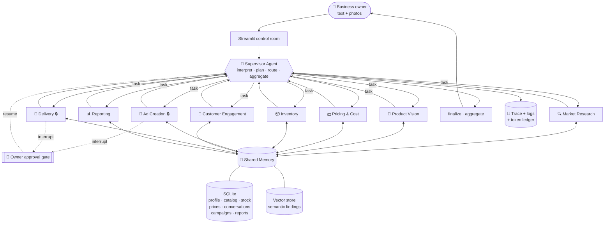

# Architecture

## 1. System overview

The AI Business Workforce is a **supervisor-routed multi-agent system** built on
LangGraph. A single Supervisor agent interprets the owner's request, plans, and
delegates to eight specialists — one per stage of the small-business lifecycle.
Specialists never call each other directly; they return to the Supervisor, which
re-decides. Collaboration happens through two channels: a **structured message
bus** (who asked whom to do what, and what came back) and a **shared memory**
that outlives any single message.



🔒 = human-in-the-loop checkpoint. The node suspends the entire graph to the
checkpointer until the owner answers.

## 2. The eight specialists

| # | Agent | Responsibility | Key tools | Approval gate |
|---|-------|----------------|-----------|---------------|
| 1 | Market Research | Low-competition / high-demand niches, competitor price bands | Web search (Tavily → DuckDuckGo → simulated), RAG | — |
| 2 | Product Vision | Identify product from photo, demand + price fit, GO/NO-GO | Claude vision, web search, RAG | — |
| 3 | Pricing & Cost | Cost-plus price, margin, break-even, competitor comparison | Sandboxed Python execution, RAG | — |
| 4 | Inventory | Record stock (product, qty, cost, photo), low-stock alerts | SQLite, image storage | — |
| 5 | Ad Creation & Publishing | Platform-specific ad copy; publish to FB/IG/YouTube | Meta Graph API, YouTube API | 🔒 `publish_ads` |
| 6 | Customer Engagement | Read DMs/comments, sentiment, pre-orders, unmet demand | Messenger/IG API, NLP | — |
| 7 | Delivery & Logistics | Book courier pickup/delivery | Pathao / Steadfast APIs | 🔒 `book_delivery` |
| 8 | Reporting | Restock alerts, demand shifts, profit analysis, revised plan | RAG over all memory, code execution | — |

## 3. Control flow

```
START
  │
  ▼
supervisor ──► plan (first turn only)
  │
  ├─ route ──► <one agent> ──► supervisor   (loop)
  │                   │
  │                   └─ interrupt() ──► suspend to checkpointer
  │                                          │
  │                        Command(resume=…) ┘
  │
  └─ FINISH ──► finalize ──► aggregate ──► END
```

**Why every agent returns to the supervisor.** A star topology (rather than a
fixed pipeline) is what makes the system reactive: if the Customer Engagement
agent discovers demand for a product the catalog lacks, the Supervisor can route
straight back to Market Research or Pricing instead of marching through a
predetermined sequence.

**Guards.** `max_supervisor_steps` (18) and LangGraph's `recursion_limit` (60)
bound the loop. A router that returns an unknown agent name, or fails to parse,
falls through to `finalize` rather than spinning.

## 4. Agent collaboration: the two channels

### 4.1 Structured message bus

Each hand-off writes a row to `agent_messages` and an entry into graph state:

```
supervisor → pricing   task="Set a price for the frozen paratha pack"
pricing    → supervisor summary + full structured PricingResult payload
```

The **Agent comms** tab renders this bus. Because payloads are validated Pydantic
models, downstream agents consume fields programmatically rather than re-parsing
prose — e.g. `market_research.competitor_price_low/high` flows directly into the
Pricing agent's inputs, and `pricing.recommended_price` into the ad copy.

### 4.2 Shared memory

Message passing is transient; memory is not. Two stores behind one facade
(`SharedMemory`):

- **Structured (SQLite)** — the business's system of record: profile, products,
  inventory, stock movements, pricing history, conversations, pre-orders,
  campaigns, deliveries, reports, approvals.
- **Semantic (vector store)** — every agent's conclusions, written as prose with
  `{agent, kind, session_id}` metadata and retrieved by meaning.

This is what lets the Reporting agent, running last, ask *"what price did we
decide and why"* and get the Pricing agent's reasoning from three stages earlier
— including across process restarts and separate sessions. The **Memory** tab's
"Retrieval test" runs exactly this query path, so the mechanism is inspectable
rather than asserted.

Embeddings use a deterministic hashed bag-of-words projection (512-d, L2
normalised, sub-linear term weighting). That keeps the system fully offline with
no model download and no embedding-API spend, which matters for a corpus of this
size; the `VectorStore` interface is a drop-in seam for a hosted embedding model.

## 5. Human-in-the-loop

Implemented with LangGraph's `interrupt()` plus a **SQLite checkpointer**, not a
UI-level confirm dialog. When `AdCreativeAgent` reaches the publish step it calls
`self.request_approval(...)`; LangGraph persists the entire graph state and
unwinds. The Streamlit process can restart and the run is still recoverable.

Three decisions are supported:

| Decision | Effect |
|---|---|
| `approve` | The agent proceeds — publishes / books the courier |
| `reject` | The action is skipped; the draft is still saved for the owner |
| `request_changes` | Feedback is fed back into the prompt and the agent **rewrites** (up to 2 revisions) |

`request_changes` is the meaningful one: it is a genuine correction loop, not a
binary gate. Every decision is persisted to the `approvals` table and appears in
the trace.

Pause / resume / retry:
- **Pause** happens implicitly at any interrupt.
- **Resume** — `runtime.resume(session_id, decision)` sends `Command(resume=…)`.
- **Retry** — `runtime.retry(session_id)` re-enters from the last checkpoint; the
  Supervisor sees the recorded error in state and decides whether to re-run the
  failed agent or route around it.

## 6. Tool integration

| Tool | Implementation | Degradation path |
|---|---|---|
| Web search | Tavily API | → DuckDuckGo (no key) → labelled simulated adapter |
| Vision | Claude native multimodal (base64), auto-downscale > 5 MB | required |
| Code execution | Restricted `exec` — whitelisted builtins, regex deny-list, 10 s timeout, no imports/IO/network | required |
| RAG | In-process vector store | required |
| Meta Graph API | Real FB feed + IG container/publish calls | → simulated adapter |
| YouTube | API key read path | publishing always simulated (needs OAuth consent) |
| Courier | Steadfast + Pathao REST | → simulated consignment |

**On simulated adapters.** Meta requires business verification and Pathao/Steadfast
require merchant accounts — neither is obtainable inside the project timeline. The
simulated adapters return responses in the **same shape** as the live ones, so agent
logic never branches on which mode is active; only the `simulated` flag differs, and
it is surfaced in the trace, the database, the ad preview and the final report. Adding
the key to `.env` switches to live with zero code change.

## 7. Observability

Every agent action, tool call, hand-off, LLM call, approval and failure emits a
`TraceEvent` to an append-only store (in-memory deque for live polling + SQLite for
durability). The UI reads the same store the system writes — there is no separate
telemetry path that could drift from reality.

**Error containment.** `BaseAgent.__call__` wraps `execute()` in a catch-all: a
failing agent produces `ok=False` plus an error string, which is recorded in state
and shown to the owner. The Supervisor sees the failure on its next routing decision
and can retry, route around it, or finish. A single agent failure never crashes a run.

**Cost accounting.** Structured LLM calls use `include_raw=True` so the underlying
`AIMessage` survives parsing and its `usage_metadata` can be read. Cached tokens are
subtracted from the input count and re-billed at their own multipliers (0.1× read,
1.25× write) rather than being double-charged at the full input rate.

## 8. Repository layout

```
app.py                     Streamlit entry point
ui/panels.py               Panel render functions
src/aiworkforce/
  config.py                Settings + LIVE/SIMULATED capability flags
  pricing.py               Token accounting and USD cost estimation
  llm.py                   Claude client factory (effort, no rejected params)
  observability.py         Logging, trace event bus, error containment
  state.py                 LangGraph state schema and reducers
  supervisor.py            Planner / router / aggregator
  graph.py                 Graph assembly + WorkforceRuntime
  memory/
    db.py                  SQLite system of record
    vector.py              Semantic store
    shared.py              SharedMemory facade
  tools/
    web_search.py          Tavily → DuckDuckGo → simulated
    vision.py              Image encoding + multimodal message building
    code_exec.py           Restricted Python sandbox
    social.py              Meta Graph + YouTube adapters
    courier.py             Pathao + Steadfast adapters
  agents/
    base.py                BaseAgent: LLM, memory, approval, error containment
    schemas.py             Pydantic contracts for every agent output
    <eight agent modules>
```

## 9. Design decisions worth defending

1. **Star topology over a fixed pipeline** — reactive replanning when customer
   signal contradicts the original plan.
2. **Memory over message-passing alone** — later stages read earlier reasoning
   without it being threaded through every intermediate message.
3. **Python owns the arithmetic, the model owns the judgement** — the Pricing
   agent's numbers are recomputed deterministically at the model's chosen price,
   so the model explains the decision but cannot mis-state the maths.
4. **Approval is a graph interrupt, not a UI dialog** — pause survives a process
   restart, and `request_changes` is a real revision loop.
5. **Recomputed, not trusted** — low-stock alerts, sentiment breakdowns and
   financials are recomputed from the database after the model responds, so
   displayed figures cannot drift from the record.
