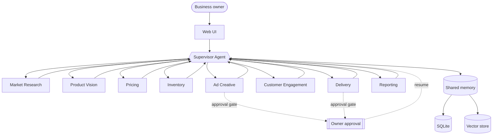

# Lucida — AI Workforce Submission

## Project title
Lucida: An Interactive Multi-Agent AI Workforce for a Small Business

## Repository
https://github.com/EsmeAbha/Business_Marketing_Analysis_LLM

## Team / authorship
This submission packages the working implementation of the multi-agent business intelligence system developed in this repository.

## Problem and solution
Lucida is a supervisor-routed multi-agent AI system for a small shop in Dhaka. Instead of a single chatbot, it coordinates specialist agents for market research, product vision, pricing, inventory, ad creative, customer engagement, delivery, and reporting. A shared memory layer and LangGraph supervisor coordinate the workflow, while human approval gates halt risky actions such as publishing ads or booking delivery.

## What is included
- Supervisor-driven workflow with specialized agents
- Shared memory and semantic retrieval
- Human-in-the-loop approvals
- Tool integration for web search, image analysis, pricing math, courier APIs, and channel adapters
- Observability, logging, and cost tracking
- Web UI with live execution trace and workforce dashboard

## Core architecture
The system uses LangGraph with a star topology: every specialist returns to the supervisor, which re-routes based on completed work, new evidence, or missing inputs.



## Minimum requirement mapping
- Supervisor agent: implemented in [src/lucida/supervisor.py](../src/lucida/supervisor.py)
- 8 specialized agents: implemented in [src/lucida/agents](../src/lucida/agents)
- Agent-to-agent communication: handled via supervisor routing and message bus in the graph state
- Shared memory / knowledge base: implemented in [src/lucida/memory](../src/lucida/memory)
- Tool integration: implemented under [src/lucida/tools](../src/lucida/tools)
- Logging and error handling: implemented via [src/lucida/observability.py](../src/lucida/observability.py)
- Interactive UI: served by [serve.py](../serve.py) and the web app under [web](../web)

## Running locally
```bash
python -m venv .venv
.venv\Scripts\pip install -r requirements.txt
copy .env.example .env
python serve.py
```

Then open:
http://127.0.0.1:8000

## Verification
The current repository includes deterministic tests for the multi-agent infrastructure, memory retrieval, sandbox safety, and adapter behavior.

```bash
python -m pytest tests -q
```

## Submission note
This project is ready as a working multi-agent system submission, with the implementation code, architecture notes, and execution requirements documented in the repository.
